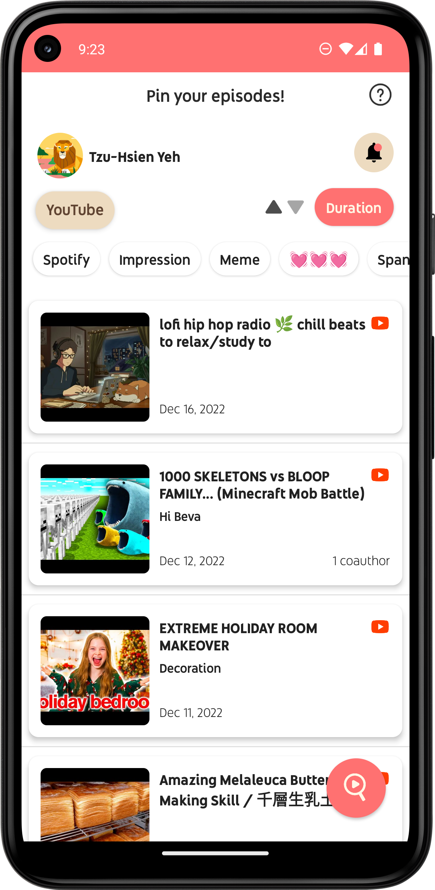
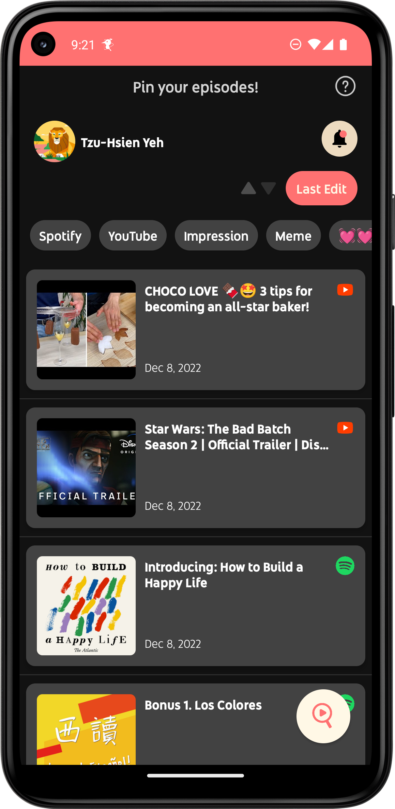
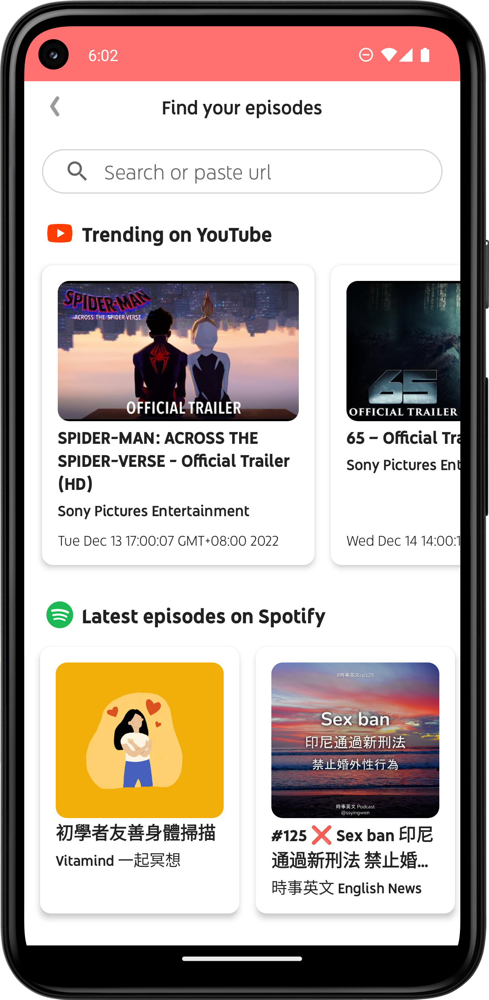

# Pinpisode—YouTube & Spotify Note
<!-- Badges -->

      

For those who want to review, make notes on, or share certain parts of a video/podcast, Pinpisode realizes timestamps taking and clipping on YouTube/Spotify media, featuring co-authorship with other users.

<div align="center"> 
  
  
<br />
  <a href="https://play.google.com/store/apps/details?id=com.tzuhsien.pinpisode">
      </a>

</div> 

# Table of Contents
- [Features](#features)
    * [Sign in with Google](#sign-in-with-google)
    * [Personal Note List](#personal-note-list)
    * [In-App Search](#in-app-search)
    * [Time Notes](#time-notes)
    * [Coauthoring](#coauthoring)
    
- [Technical Highlights](#technical-highlights)
    * [Code Samples](#code-samples-timestamp-taking-and-clipping-in-notification)
    
- [Requirements](#requirements)
    * [Environment Variables](#environment-variables)


<br/>

## Features
### Sign in with Google
- Authenticated users with Firebase using their Google Accounts

  

<br/>

### Personal Note List
- Sort notes by tags or order by last edit / media duration / time left from last timestamp to the end of the media
- Swipe left to quit a note / quit coauthoring
- Show the guide to the current page from the help icon (automatically show up for new users)
- Entry points of [Profile](#sign-in-with-google), [In-App Search](#in-app-search), [Coauthor Invitations](#co-authoring)
- Support dark mode

   

<br/>

### In-App Search
- Show trending videos on YouTube
- List the latest episodes of all the saved podcast shows of the user on Spotify
- Search by pasting YouTube/Spotify share link
- Search by keyword

  

<br/>

### Time Notes
##### General

  - Enter the note page via sharing from YouTube / Spotify
  - Add an editable time card upon timestamp taken :pushpin: or clipped :scissors:
  - Swipe left to delete a time card
  - Click the time card to seek to the timestamp/the clip
  - Toggle view mode: all, timestamp-only, and clip-only
  - Manage tags of the note
  - Invite users to coauthor the note / quit coauthoring (if the user is not the note owner)
  - Share the note (read-only for non-authors)
  
   


##### YouTube Note
  - Take timestamps and clip in full screen view
  - Take timestamps and clip on live streams


##### Spotify Note
- Take timestamps and clip in Notification (available on lock screen)

 


<br/>

### Coauthoring
  - Find other Pinpisode users by emails and send coauthor invitations
  - Check incoming coauthor invitations from the :bell: icon on the top right of [Note List](#personal-note-list) page
  - Accept or decline coauthor invitations
  - Quit coauthoring the note thereafter

  
  

<br/>


## Technical Highlights

- Constructed the app with **MVVM** architecture and **Repository** Pattern to seperate UI, business logic, and data and to have a single source of truth

- Connected the app to RESTful APIs (YouTube Data API and Spotify Web API) with **Retrofit**, parsing the JSON response with **Gson**

- Implemented **OAuth 2.0** authorization for user to grant access to call **Spotify Web API**

- Interacted the app with Spotify app to control playback and access metadata via **Spotify App Remote SDK**

- Incorporated **Foreground Service**, **Notification**, and **Broadcast Receiver** to enable timestamps-taking and clipping on lock screen

- Generated **Firebase Dynamic Links** for deep linking into YouTube/Spotify note page or redirecting to Google play store if Pinpisode not installed

- Registered the app to received implicit intents from YouTube/Spotify to allow instant note creation by clicking Pinpisode appearing in share list

- Hosted data on **Firebase Cloud Firestore** to synchronize across devices, achieving realtime co-authoring

- Used **Glide** for loading and caching images

- Created an **adaptive launcher icon** adapting to user theming


<br/>

### Code samples: timestamp-taking and clipping in Notification

Send pending intents of an action to `BroadcastReceiver` when the button in the customed notification view is clicked
```kotlin
    private fun startClippingPendingIntent(context: Context): PendingIntent {
        val clipIntent = Intent().apply {
            action = TimestampReceiver.ACTION_CLIP_START
        }
        return PendingIntent.getBroadcast(context, REQUEST_CODE, clipIntent, PendingIntent.FLAG_IMMUTABLE)
    }
```

<br/>

Register the `BroadcastReceiver` in the SpotifyNoteFragment to call the timestamp-taking/clipping functions upon receiving actions
```kotlin
    private val timestampReceiver = TimestampReceiver(TimestampReceiver.OnActionListener {
        when (it) {
            TimestampReceiver.ACTION_TAKE_TIMESTAMP -> takeTimestamp()
            TimestampReceiver.ACTION_CLIP_START -> startClipping()
            TimestampReceiver.ACTION_CLIP_END -> endClipping()
        }
    })

    private fun registerTimestampReceiver() {
        val filter = IntentFilter().apply {
            addAction(TimestampReceiver.ACTION_TAKE_TIMESTAMP)
            addAction(TimestampReceiver.ACTION_CLIP_START)
            addAction(TimestampReceiver.ACTION_CLIP_END)
        }
        context?.registerReceiver(timestampReceiver, filter)
    }
```

<br/>

Start Foreground Service with `ACTION_START_CLIPPING` or `ACTION_DONE_CLIPPING` to sync the status of the clipping button in the notification and on the note page
<br/>

SpotifyNoteFragment
```kotlin
private fun startClipping() {
  
  ...
  
  Intent(context, SpotifyNoteService::class.java).apply {
            this.action = SpotifyNoteService.ACTION_START_CLIPPING
            context?.startService(this)
        }

}
```
<br/>

Foreground Service

```kotlin
  class SpotifyNoteService : Service() {
  
    ... 
  
    override fun onStartCommand(intent: Intent?, flags: Int, startId: Int): Int {
        when (intent?.action) {
            ACTION_START -> start()
            ACTION_STOP -> stop()
            ACTION_START_CLIPPING -> startClipping()
            ACTION_DONE_CLIPPING -> doneClipping()
        }

        return super.onStartCommand(intent, flags, startId)
    }

    ...
  }
```

<br/>

## Requirements
- Android Studio Chipmunk
- Gradle 7.2.1
- Android SDK 32

#### Environment Variables
To run this project, you will need to add the encrypted YouTube API key as `encodedYtApiKey` to your `local.properties` file


